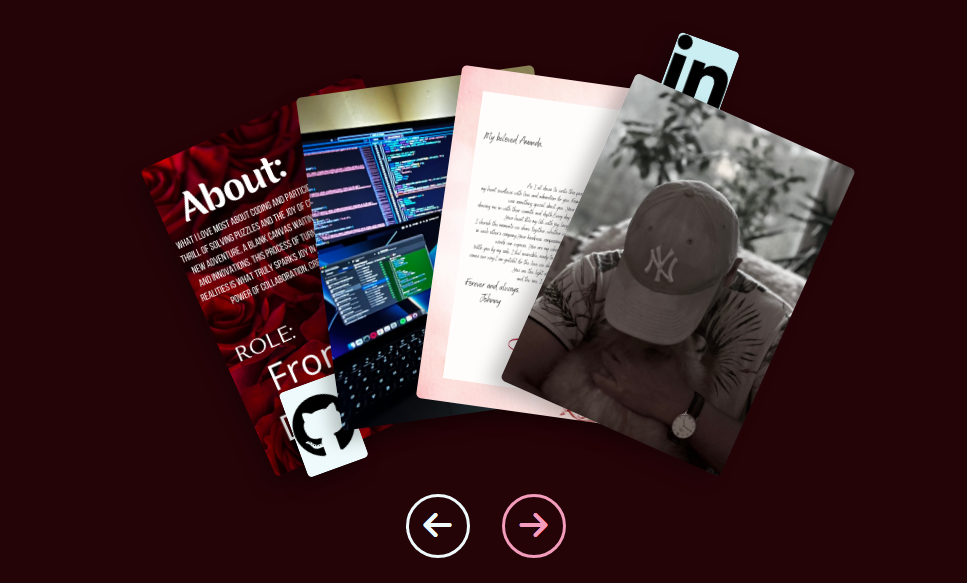

<h1 align="center">Hi there 👋, I'm Johnny</h1>

- 🌱 I’m currently learning **Typescript**
- 📖 Full-stack development student at [Code Institute](https://codeinstitute.net/)
 

<h4>How to reach me</h4>

 
  
  
   

##

<table align="center">
  <tr>
    <td align="center" colspan="2"><h2>Github Trophies</h2></td>
  </tr>
  <td align="center" colspan="2">

  

 </td>
</table>

<h3 align="left">Languages and Tools:</h3>

   
  
 
  
   
   
   
   
   
   
   
  
   
   
   
  

<h2 align='center'> &#x1F4BC; Projects</h2>

- #### [PORTFOLIO](https://github.com/JohnnySonTrinh/react-portfolio)

<table>
  <tr>
    <td>
      
    <td>
      Halo Theme Portfolio. Designed to showcase the professional profile, visual metaphor that borrows from the skill trees commonly found in video games, reinforcing the user's gaming background.
    </td>
  </tr>
</table>

- #### [VALORANT TIC TAC TACTICS](https://github.com/JohnnySonTrinh/valorant-tic-tac-tactics)

<table>
  <tr>
    <td>
     Valorant Tic-Tac-Tactics combines the strategic gameplay of Valorant with the simplicity and charm of Tic-Tac-Toe. This project aims to provide a fun, engaging, and interactive gaming experience for both Valorant enthusiasts and casual gamers alike.
    </td>
    <td>
      
    </td>
  </tr>
</table>

- #### [A GAMERS PORTFOLIO SITE](https://github.com/JohnnySonTrinh/a-gamers-portfolio-site)

<table>
  <tr>
    <td>
      
    <td>
      "A Gamer's Portfolio Site," gaming meets the finesse of web development. This site isn't just a showcase; it's a my passion for video games and my proficiency in front-end development.
    </td>
  </tr>
</table>

- #### [GAMER THREADS](https://github.com/JohnnySonTrinh/ebuddies)

<table>
  <tr>
    <td>
     Ebuddies community platform designed to connect gamers with shared interests and hobbies. Our mission is to create a welcoming space where users can find and interact with like-minded peers, share experiences, and build meaningful connections.
    </td>
    <td>
      
    </td>
  </tr>
</table>

- #### [SNAKE](https://github.com/JohnnySonTrinh/snake-game)
<table>
  <tr>
    <td>
     This is a simple terminal based snake game implemented in Python. which runs in the Code Institue mock terminal on Heroku.
    </td>
    <td>
      
    </td>
  </tr>
</table>

<h2 align='center'> &#128187; Hackathons</h2>

|                                                          Name                                                           |                                                                                                                      Hackathon                                                                                                                       |                                                                            Certificate                                                                            |
| :---------------------------------------------------------------------------------------------------------------------: | :--------------------------------------------------------------------------------------------------------------------------------------------------------------------------------------------------------------------------------------------------: | :---------------------------------------------------------------------------------------------------------------------------------------------------------------: |
|       ❄️ 12 Days of Quizmas - [Secret Santa Hackathon](https://hackathon.codeinstitute.net/hackathon/public/40/)        |                                                                            |        |
|  💰 Fund Frontier - [Budget Busters: New Year, New Numbers!](https://hackathon.codeinstitute.net/hackathon/public/41/)  |  |  |
|          💘 Cupid's Helpers - [Cupid's Code Quest!](https://hackathon.codeinstitute.net/hackathon/public/42/)           |                                                                                                                                       |     |
| 🌌 The Sabersmiths - [Code Wars: The Hackathon Strikes Back!](https://hackathon.codeinstitute.net/hackathon/public/47/) |                                                      |  |
